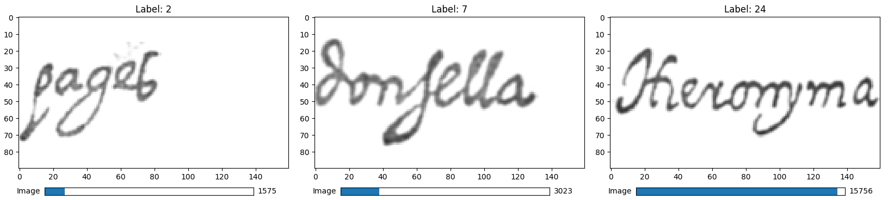
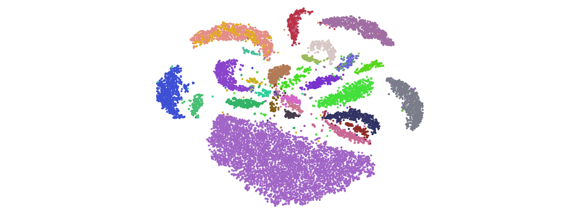

# Assignment 3 - Dimensionality reduction

In this assignment, you will look at some of the methods (PCA, t-SNE, and UMAP) that were introduced in the course for reducing the number of dimensions in high-dimensional data, so that this data can be visualized for example in 2D. Projecting (or embedding) data points in this way is useful when one for example wants to visually identify clusters in the data. For this excercise, we will not use ParaView - instead, you will do a bit of Python programming and get familiar with some libraries that implement the above methods.

Requirements to pass: Before the deadline, hand in code and answers for Parts 1-3 in form of a Jupyter notebook. See the main course page for more details.

## Obtaining the source code and datasets

For the source code, download (or clone) the Git-repository of this assignment.

The dataset that we will use was created by Anders Hast and can be downloaded from [here](https://www.cb.uu.se/~aht/dataset/). It contains scanned images of 30 different words extracted from the larger [Espossales database](http://dag.cvc.uab.es/the-esposalles-database/). Each image has a label associating it with one of the 30 words. The label data is stored in a separate file that you also need to download. A bit more information about the dataset can be found [here](https://andershast.com/datasets/).

## Setting up the Python environment

  1. Install the Anaconda (Miniconda) package manager for Python 3.9 from [here](https://docs.conda.io/en/latest/miniconda.html). On Linux, you can also install it like this:

    curl -O https://repo.anaconda.com/miniconda/Miniconda3-latest-Linux-x86_64.sh  
    sh Miniconda3-latest-Linux-x86_64.sh

  2. Create a new virtual Python environment (here called `vetvis` as an example) from the terminal or the Anaconda command line:

    conda create -c conda-forge --name vetvis python=3.9

  3. Activate the new virtual environment and install the required Python dependendecies (via the `pip` package manager):

    conda activate vetvis
    pip install numpy scipy matplotlib scikit-learn umap-learn
  
  4. When you work on the assignment, you should create a [Jupyter notebook](https://jupyter.org/) that also should contain answers to the questions of each part. For this, you also need to install Jupyter Notebook and start the local server (the last command should be executed from the folder where you extracted the assignment source code and datasets):

    pip install jupyter
    jupyter-notebook
  
  To check that your new Python environment works and that all libraries are installed correctly, you can download the Jupyter notebook found under the course module "Introduction to Python" in Studium and try the examples there. If you start the notebook server in the same directory as the `.ipynb` file, Jupyter should automatically open a new web browser tab or window where you can find it.

## Part 1: PCA and plotting

To get started, run from the terminal (or command line) the provided script `image_viewer.py` that loads the dataset (`Esposalles-bgr-images` and `Esposalles-bgr-labels`) and then shows a Matlplotlib window where you can scroll through the stack of images. Also look in the script `load_mnist.py` to try to understand the format of the data and how it is loaded.

Now create a new Jupyter notebook and copy the code from `image_viewer.py` there. When you run this notebook in the web browser, the dataset should load as before and the Matlplotlib figure for the viewer should appear in the notebook.

The first method for dimensionality reduction that you will try on the data is [principal component analysis](https://en.wikipedia.org/wiki/Principal_component_analysis) (PCA), which is implemented by this [class](https://scikit-learn.org/stable/modules/generated/sklearn.decomposition.PCA.html) of the [scikit-learn](https://scikit-learn.org) library. Use the following code snippet,

    transformer = PCA(n_components=2)
    proj = transformer.fit_transform(np.array([x.flatten() for x in images_small])

to project a smaller subsampled version (`images_small`) of the full dataset. When you flatten a grayscale image like in the code above, it will become a feature vector with `W x H` dimensions (where `W` and `H` are the width and height of the image in pixels). Now add a separate Matplotlib figure where you plot the projected data points colored by their labels (for the subsampled data, this is `labels_small`). The plot should also have a legend. There is a color lookup table provided in `image_viewer.py` that you can use to assign a unique randomized color to each label. (If you are not very familiar with Python programming or from using Matplotlib from before, you can look at the notebook from Nicolas' lecture for some hints)

Questions to answer:
- What does the PCA projection on the smaller dataset look like? Does it seem to separate the labels well?

## Part 2: t-SNE

The next method you will experiment with is [t-SNE](https://en.wikipedia.org/wiki/T-distributed_stochastic_neighbor_embedding), which should be able to better separate the labels compared to the previous method. You need to create a new `transformer` object from this [class](https://scikit-learn.org/stable/modules/generated/sklearn.manifold.TSNE.html). t-SNE will use PCA as a starting guess for the projection if you set the `init` parameter to `"pca"`, otherwise it will use `"random"`. Try both initializations on the smaller dataset (`images_small` and `labels_small`), and then on the full dataset (`images` and `labels`). (Note: computing t-SNE on the full dataset can take a while, depending on how many cores your computer have and how fast it is)

If you repeat the projection multiple times (and plot it), you should notice that the result is not deterministic between runs! Change the parameters now so that t-SNE becomes deterministic (you can find some hints for how to do this in the documentation and in the other notebook). This makes parameter tuning like setting the number of iterations easier.

Questions to answer:
- How does t-SNE seem to compare to PCA on the smaller dataset, when using PCA as starting guess and 1000 iterations for the method? What happens when you increase the number of iterations to 5000, and decrease it to 250?
- How does t-SNE perform on the full dataset with PCA as starting guess compared to random initialization, for the same number of iterations (1000)?

## Part 3: UMAP

UMAP is implemented in a separate library, [umap-learn](https://umap-learn.readthedocs.io/en/latest/). The UMAP [class](https://umap-learn.readthedocs.io/en/latest/api.html#umap.umap_.UMAP) in this library works similar to the PCA and TSNE classes from scikit-learn, so you need to create yet another new transformer object for UMAP.

Try UMAP on the smaller dataset, and experiment with different values of the `min_dist` parameter that controls the spacing between the data points. When you try it on the full dataset, you can set this parameter to the maximum value (which is `0.99`).

Questions to answer:
- What seems to be a good value for `min_dist` for the smaller dataset?
- Which of the two methods t-SNE or UMAP seems to provide the best separation of the word labels on the full dataset? Can you find some example of two labels that both methods fail to separate? 